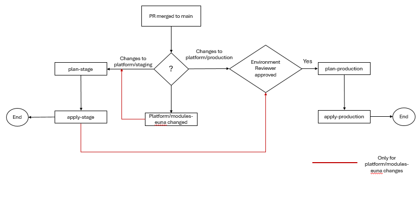

# Checkly Terraform CI/CD Workflow

This document provides an overview of the GitHub Actions workflow responsible for the continuous integration and deployment of Checkly resources managed by Terraform.

## Workflow Overview

The primary purpose of this workflow is to automate the validation, planning, and application of Terraform changes to our Checkly monitoring setup across different environments (Staging and Production).

The workflow is triggered automatically when a pull request is merged into the `main` branch. It uses a path-based filtering system to determine which environments are affected by the changes and runs the appropriate deployment jobs.

### Workflow Diagram


## Trigger Conditions

The workflow starts under the following conditions:
- **Event:** A `pull_request` is `closed`.
- **Branch:** The target branch of the pull request is `main`.
- **Merged:** The pull request must have been successfully `merged`.

## Job Breakdown

The workflow is composed of several sequential and parallel jobs:

### 1. `changes`
- **Purpose:** Detects which file paths have been modified in the merged pull request.
- **Outputs:** Sets boolean outputs (`staging`, `production`, `modules-euna`) that are used to conditionally trigger the subsequent planning and deployment jobs.

### 2. `plan-staging`
- **Purpose:** Generates a Terraform plan for the **staging** environment.
- **Trigger Condition:** Runs if changes are detected in `platform/staging/**` or `platform/modules-euna/**`.
- **Key Actions:**
    - Configures AWS credentials using OIDC.
    - Initializes and validates the Terraform configuration.
    - Runs `terraform plan` and saves the plan file (`staging.tfplan`).
    - Uploads the plan and `.terraform.lock.hcl` file as artifacts for the `apply` job.

### 3. `apply-staging`
- **Purpose:** Automatically applies the Terraform plan to the **staging** environment.
- **Trigger Condition:** Runs automatically upon the successful completion of the `plan-staging` job.
- **Key Actions:**
    - Downloads the plan and lock file artifacts.
    - Runs `terraform apply` with the plan file to deploy the changes.

### 4. `plan-production`
- **Purpose:** Generates a Terraform plan for the **production** environment.
- **Trigger Condition:** Runs if changes are detected in `platform/production/**` or `platform/modules-euna/**`.
- **Environment:** This job is protected by the `Checkly_Production_Deployment` environment, which requires **manual approval** from a designated reviewer before the job can proceed.
- **Key Actions:**
    - Similar to `plan-staging`, but targets the production directory.
    - Uploads the production plan (`production.tfplan`) and lock file as artifacts.

### 5. `apply-production`
- **Purpose:** Applies the Terraform plan to the **production** environment after it has been reviewed and approved.
- **Trigger Condition:** Runs upon the successful completion of the `plan-production` job.
- **Key Actions:**
    - Downloads the production plan and lock file.
    - Runs `terraform apply` to deploy the changes to production.

## Required Secrets and Variables

To function correctly, the workflow requires the following secrets to be configured in the repository settings:

- `CHECKLY_ACCOUNT_ID`: The ID of the Checkly account.
- `CHECKLY_API_KEY`: The API key for the Checkly account.
## GitHub App Installation
- `GitHub App`: GitHub App with permissions to checkout repositories, including submodules should be installed to "observability-iac" repo which is under "Euna - Infrastructure" organization.
## Authentication

The workflow uses OpenID Connect (OIDC) to securely authenticate with AWS S3 bucket without needing to store long-lived IAM access keys as secrets. It assumes the IAM role `arn:aws:iam::<AWS Account ID>:role/<AWS IAM Role>` to get temporary credentials for running Terraform.

## Staging environment
If staging environment is not part of initial rollout and needs to be added later then follow below steps
- Un-comment plan-staging and apply-staging jobs in workflow yml file
- Update AWS_Account_ID, AWS_IAM_Role & aws_region of relevant S3 bucket(for terraform statefile) as shown below. These values need to
  be updated for both plan-staging and apply-staging jobs.

```yaml
- name: Configure AWS Credentials via OIDC
        uses: aws-actions/configure-aws-credentials@v4
        with:
          role-to-assume: arn:aws:iam::<AWS_Account_ID>:role/<AWS_IAM_Role>
          aws-region: <To be updated with staging environment S3 bucket region>
```
- In the plan-production job add apply-staging under needs tag as shown below
  
```yaml
 plan-production:
    name: 'Plan Production'
    runs-on: ubuntu-latest
    needs: [changes, `apply-staging`]
    if: always() && (needs.changes.outputs.production == 'true' || needs.changes.outputs.modules-euna == 'true')
    environment: Checkly_Production_Deployment
```
